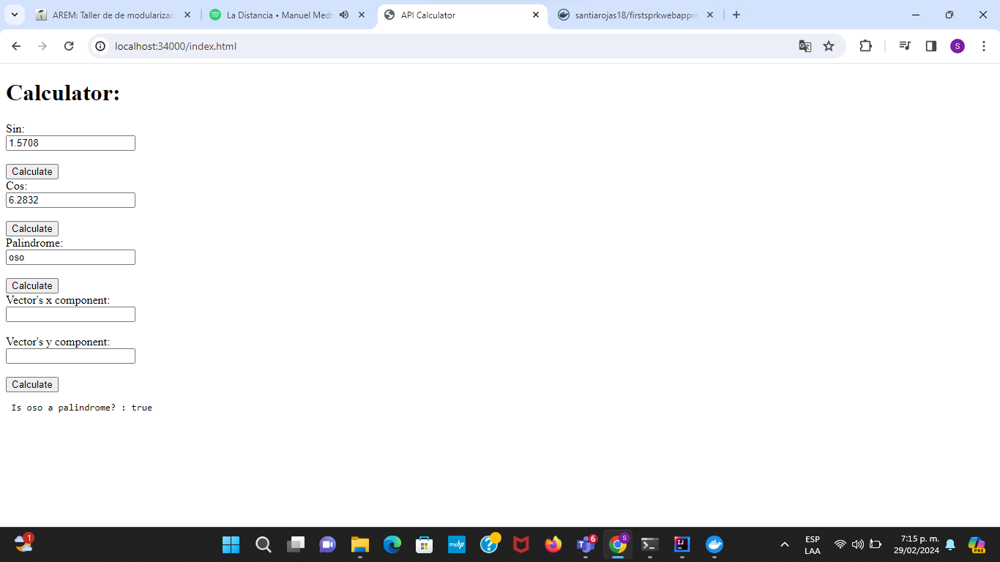

### Escuela Colombiana de Ingeniería

### Arquitecturas Empresariales


#### TALLER 5: TALLER DE MODULARIZACIÓN CON VIRTUALIZACIÓN E INTRODUCCIÓN A DOCKER

#### Santiago Arévalo Rojas

### Instrucciones para ejecución
Para ejecutar la aplicación se deben seguir los siguientes pasos:  
1. Se debe bajar la imagen de docker hub, para esto se abre la consola y se ejecuta el siguiente comando:  
    ```docker pull santiarojas18/firstsprkwebapprepo:latest```  
2. Para verificar que se tiene la imagen, se puede hacer mediante el comando:  
    ```docker images```  
    Con esto evidenciamos que la imagen santiarojas18/firstsprkwebapprepo se bajó con éxito:  
      
3. Otra manera para verlo es mediante el docker desktop, donde encontramos también la imagen:  
      
4. Luego se crea una instancia de contenedor de docker con el puerto 46000, enlazado al puerto físico 34000 del computador:  
    ```docker run -d -p 34000:46000 --name firstdockercontainer santiarojas18/firstsprkwebapprepo```  
5. Y verificamos que esté corriendo el contenedor, ya sea por línea de comandos:  
    ```docker ps```  
      
    O por medio de docker desktop, donde vemos el contenedor firstdockercontainer:  
      
6. Una vez se hayan realizado los anteriores pasos, ya se puede acceder a los servicios, para esto, se debe ingresar a la URL [http://localhost:34000/index.html](http://localhost:34000/index.html), que muestra la siguiente aplicación web con las funcionalidades solicitadas:  
      
7. Para calcular el seno de un ángulo se ingresa en radianes, en este caso se pregunta por el Seno de pi/2 = 1.5708 y se le da click a "Calculate":  
      
8. Después para el coseno de un ángulo se hace de la misma manera, para probarla se pide calcular el Coseno de 2pi = 6.2832 y ahora click a "Calculate" pero esta vez al que está debajo del formulario de Coseno: 
      
9. Ahora si se desea averiguar sobre si una palabra es palindroma o no, solo basta con escribirla en el formulario de "Palindrome" y hacer click al botón, como en este caso, por la palabra "oso":  
      
10. Finalmente, para conocer la norma de un vector de dos dimensiones, se ingresan sus componentes x y, en los formularios para esto y se obtiene el valor de su norma, para probarlo se hace con la terna pitagórica, 3,4,5:  
      


### Información del diseño

* En cuanto a la arquitectura, es un monolito contenerizado en docker, que finalmente es subido a docker hub para su uso público.  
* Hablando un poco del diseño de clases, es un proyecto muy simple, con una única clase que es la encargada de responder a las solicitudes web por medio del framework Spark y que hace uso del API de Java para realizar los cálculos solicitados.  
* Por otra parte, en cuanto al cliente asíncrono, se hace retornando un archivo estático del servidor web y no se hace quemando el código dentro del código fuente, así mismo el HTML llama a un archivo js del mimso servidor.